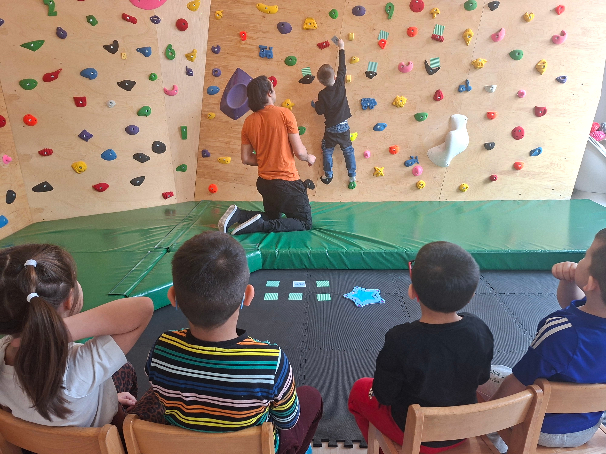
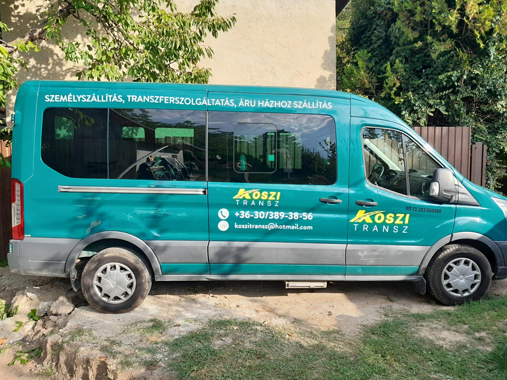

A foglalkozások óvodai csoportok számára, előre egyeztetett rendben zajlanak, heti rendszerességgel. A rendszer hasonlóan illeszkedik az intézményi napirendbe, mint más  különfoglalkozások (pl. úszás).
A Climbee óvodai programjai strukturált, játékos keretek között valósulnak meg, ahol a mozgás, a szenzoros tapasztalás és a kognitív készségek fejlesztése egységben jelenik meg.

### A foglalkozásokról

A program szakmai alapját a gyógypedagógia, a drámapedagógia és az élménypedagógia integrált szemlélete adja. Egy alkalom időtartama 50 perc, amely során a gyerekek kis csoportokban, életkorukhoz és fejlettségi szintjükhöz igazodó feladatokon keresztül vesznek részt. A fejlesztés fókuszában a komplex idegrendszeri érés támogatása áll, kiemelt hangsúlyt helyezve:

* a mozgáskoordináció és egyensúly fejlesztésére
* a figyelmi funkciók és önszabályozás erősítésére
* a szenzoros integráció támogatására
* a kommunikációs és együttműködési készségek fejlődésére
* a testtudat és térbeli tájékozódás finomhangolására

Óvodák jelentkezését és együttműködési megkeresését szívesen fogadjuk. A program gördülékeny lebonyolítása érdekében igény esetén a szállítást is biztosítani tudjuk, gyerekek számára kialakított kisbusszal. 
Amennyiben az intézmények részéről igény merül fel, szívesen tartunk bemutató / demo napot, amelyet nálunk vagy az óvodában is meg tudunk valósítani. Szükség esetén kitelepülésre is van lehetőség, ugyanis rendelkezünk erre a célra kialakított, bordásfalra felhelyezhető mászófal rendszerrel, amely biztonságosan használható helyszíni,bemutató foglalkozás lebonyolításához is.

Jelenlegi partnerintézményünk:

[Orchidea Óvoda](https://www.ohebs.hu/%C3%B3voda/%C3%B3voda_az_orchidea_%C3%B3vod%C3%A1r%C3%B3l)

